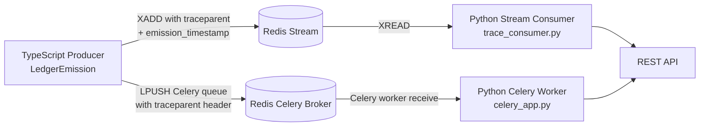
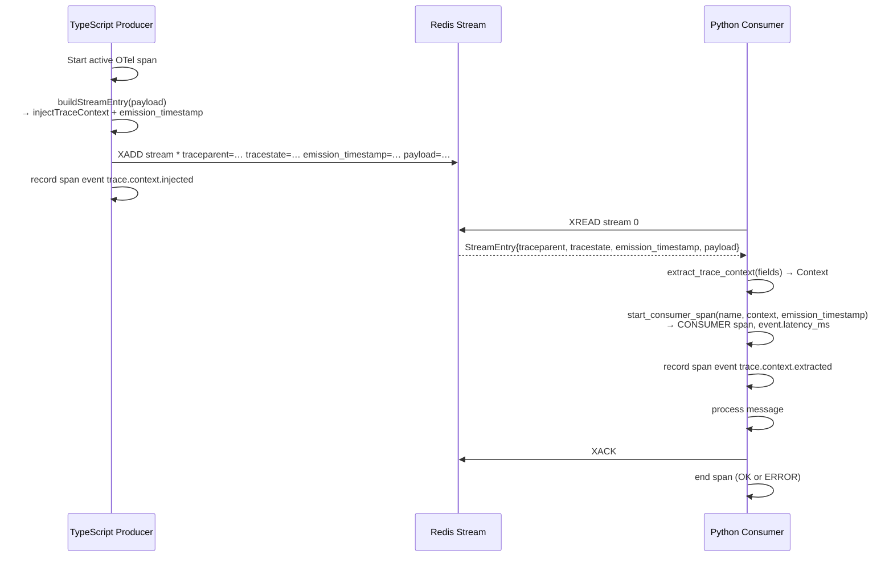

# Design Document: Distributed Trace Propagation

## Overview

This feature bridges the two trace-context gaps in the StellarFlow backend pipeline: the
Redis Stream boundary and the Celery task dispatch boundary. Today the OpenTelemetry SDK is
already initialised on the TypeScript side and W3C `traceparent`/`tracestate` headers are
propagated across HTTP. This design extends that propagation so that a single trace
originating at a `LedgerEmission` event is visible end-to-end in Jaeger, and so that the
elapsed time from ledger emission to API availability is recorded as the `event.latency_ms`
span attribute.

The change is **additive only**: no existing files are modified. Two new TypeScript modules
handle injection; two new Python modules handle extraction and Celery worker setup.

### Key Goals

- Propagate W3C trace context through Redis Stream `XADD` field metadata.
- Propagate W3C trace context through Celery task headers.
- Record `emission_timestamp` at the producer and compute `event.latency_ms` at the consumer.
- Leave existing Redis caching, HTTP tracing middleware, and TypeScript SDK configuration
  untouched.
- Surface injection/extraction events as named span events (`trace.context.injected`,
  `trace.context.extracted`, `trace.context.missing`) for production observability.

---

## Architecture

The pipeline has four stages bridged by this feature:





### Design Decisions

**Why new files instead of modifying existing ones?**
The requirements mandate additive-only changes. The new modules (`streamTraceProducer.ts`,
`celeryTraceProducer.ts`, `trace_consumer.py`, `celery_app.py`) are entirely self-contained
wrappers around the existing OTel SDK instances, avoiding any risk to the current HTTP
tracing or Redis caching paths.

**Why `propagation.inject` over manual header construction?**
Using the SDK's `propagation.inject` with `W3CTraceContextPropagator` guarantees spec
compliance (version, flags, format) without custom serialisation. The same propagator already
runs on the HTTP layer, so both sides use identical trace ID formats and are interoperable in
Jaeger.

**Why `OTLP/HTTP` for Python instead of the Thrift Jaeger agent protocol?**
The TypeScript side already uses `OTLPTraceExporter` pointed at `TRACING_JAEGER_ENDPOINT`.
Using the same OTLP/HTTP endpoint for Python avoids opening a second collector port and
keeps both language spans in the same Jaeger service view.

**Why `CeleryInstrumentor` instead of manual header injection on the consumer side?**
`opentelemetry-instrumentation-celery` handles the extraction of `traceparent`/`tracestate`
from `task.headers` automatically and sets `span.kind=CONSUMER`. The TypeScript producer
only needs to ensure those headers are present before dispatch.

---

## Components and Interfaces

### `src/tracing/streamTraceProducer.ts` (new)

Depends on `@opentelemetry/api` (already a project dependency). Does **not** import from
`src/lib/redis.ts`.

```typescript
import { propagation, context, trace } from '@opentelemetry/api';
import type { RedisClientType } from 'redis';

/**
 * Injects the W3C traceparent/tracestate from the currently active OTel context
 * into `fields`. Returns a new object that merges trace fields with the input.
 * When no active span exists the input is returned unchanged (no traceparent key added).
 */
export function injectTraceContext(
  fields: Record<string, string>
): Record<string, string>;

/**
 * Returns a new field map suitable for Redis XADD that contains:
 *  - all fields from the caller
 *  - traceparent / tracestate (when an active span exists)
 *  - emission_timestamp as Date.now().toString()
 */
export function buildStreamEntry(
  payload: Record<string, string>
): Record<string, string>;

/**
 * Calls redis XADD('*', fields) with trace context injected.
 * Records a `trace.context.injected` span event on success.
 * Re-throws Redis errors to the caller (does NOT swallow them).
 */
export async function xaddWithTrace(
  client: RedisClientType,
  stream: string,
  fields: Record<string, string>
): Promise<string>;
```

### `src/tracing/celeryTraceProducer.ts` (new)

Dispatches Celery tasks via Redis `LPUSH` to the Celery default queue key. Shares the W3C
propagation path with `streamTraceProducer.ts`.

```typescript
import { propagation, context, trace } from '@opentelemetry/api';

/**
 * Builds a headers object containing traceparent/tracestate from the active context.
 * Returns an empty object when no active span exists.
 */
export function buildCeleryHeaders(): Record<string, string>;

/**
 * Serialises a Celery task message, injects W3C headers into task.headers,
 * and pushes to the Celery broker queue via Redis LPUSH.
 * Records a `trace.context.injected` span event.
 * taskName: dotted Python path (e.g. "workers.tasks.process_ledger")
 */
export async function dispatchWithTrace(
  taskName: string,
  args: unknown[],
  kwargs: Record<string, unknown>
): Promise<void>;
```

### `src/tracing/trace_consumer.py` (new)

Pure Python module with no Celery dependency. Used by any Python code reading from Redis
Streams.

```python
from contextlib import contextmanager
from opentelemetry import trace
from opentelemetry.context import Context
from opentelemetry.trace import Span

def init_otel(service_name: str = "stellarflow-worker") -> None:
    """Initialise OTel SDK once per process. Idempotent — no-op on subsequent calls."""

def extract_trace_context(fields: dict[str, str]) -> Context:
    """
    Extract W3C context from a StreamEntry fields dict.
    Returns a new root context on missing or malformed traceparent,
    and logs a warning with the reason.
    """

def start_consumer_span(
    name: str,
    context: Context,
    emission_timestamp: str | None,
) -> Span:
    """
    Start a CONSUMER-kind span parented to `context`.
    Sets event.latency_ms when emission_timestamp is a parseable integer.
    Logs a warning and omits the attribute when it cannot be parsed.
    """

@contextmanager
def consumer_span(name: str, fields: dict[str, str]):
    """
    Convenience context manager combining extract_trace_context + start_consumer_span.
    Records trace.context.extracted on successful extraction or trace.context.missing
    on fallback. Ends the span on exit, setting ERROR status on unhandled exception.
    """
```

### `src/workers/celery_app.py` (new)

```python
from celery import Celery
from opentelemetry.instrumentation.celery import CeleryInstrumentor

app = Celery(...)         # reads broker URL from env

def on_worker_init(**kwargs):
    """worker_init signal handler — calls init_otel() before tasks execute."""

CeleryInstrumentor().instrument()   # reads traceparent from task.headers automatically
```

### Interaction with Existing Modules

| Existing module | Interaction |
|---|---|
| `src/lib/tracing.ts` | New producers import `propagation`, `context`, `trace` from `@opentelemetry/api` directly — same SDK, no dependency on `Tracing` class. |
| `src/lib/redis.ts` | Not imported. The caller passes its own `RedisClientType` to `xaddWithTrace`. |
| `src/middleware/tracingMiddleware.ts` | Unchanged. New modules do not register middleware. |
| `src/queue/pipeline.py` | Unchanged. `consumer_span` context manager can be dropped into the processor callback without touching `run_pipeline`. |

---

## Data Models

### StreamEntry field schema

All fields are strings (Redis Stream requirement).

| Field | Type (at runtime) | Required | Notes |
|---|---|---|---|
| `traceparent` | `string` | No | Present only when an active OTel span exists at injection time. W3C format: `00-{traceId}-{spanId}-{flags}` |
| `tracestate` | `string` | No | Present only when current trace state is non-empty. |
| `emission_timestamp` | `string` | Yes | `Date.now()` as decimal string (ms since Unix epoch). |
| `<payload fields>` | `string` | Yes | Business payload passed by the caller — untouched by injection. |

### Celery task message (JSON envelope)

Celery uses a JSON-serialised message envelope. The trace context is injected into the
top-level `headers` object, not inside `body`.

```json
{
  "body": "<base64 encoded [args, kwargs, embed]>",
  "headers": {
    "task": "workers.tasks.process_ledger",
    "traceparent": "00-4bf92f3577b34da6a3ce929d0e0e4736-00f067aa0ba902b7-01",
    "tracestate": ""
  },
  "content-type": "application/json",
  "content-encoding": "utf-8"
}
```

### Python span attribute

| Attribute | Type | Set when |
|---|---|---|
| `event.latency_ms` | `int` | `emission_timestamp` present and parseable |
| `span.kind` | `CONSUMER` | Always, on all consumer spans |

### Environment variables

| Variable | Used by | Purpose |
|---|---|---|
| `TRACING_JAEGER_ENDPOINT` | `trace_consumer.py`, `celery_app.py` | OTLP/HTTP collector URL |
| `REDIS_URL` | `celery_app.py` | Celery broker URL (same Redis instance) |
| `CELERY_QUEUE` | `celeryTraceProducer.ts` | Queue name for `LPUSH` (default: `"celery"`) |

---

## Correctness Properties

*A property is a characteristic or behavior that should hold true across all valid executions
of a system — essentially, a formal statement about what the system should do. Properties
serve as the bridge between human-readable specifications and machine-verifiable correctness
guarantees.*

### Property 1: Injection round-trip

*For any* active OpenTelemetry span, `injectTraceContext({})["traceparent"]` SHALL be a
well-formed W3C `traceparent` string whose `traceId` and `spanId` segments match the
originating span context exactly when parsed against the W3C regex
`/^00-[0-9a-f]{32}-[0-9a-f]{16}-[0-9a-f]{2}$/`.

**Validates: Requirements 1.1, 1.2**

---

### Property 2: No-span isolation

*For any* payload field map, when `buildStreamEntry` is called with no active OpenTelemetry
span in context, the returned map SHALL NOT contain the key `"traceparent"` and SHALL NOT
contain the key `"tracestate"`.

**Validates: Requirements 1.3, 3.3**

---

### Property 3: Payload fields are preserved by injection

*For any* non-empty payload field map `fields`, every key and every value present in `fields`
before calling `buildStreamEntry(fields)` SHALL also be present with the same value in the
returned map. Injection SHALL NOT overwrite, delete, or rename any pre-existing business
field.

**Validates: Requirements 1.4, 3.4**

---

### Property 4: emission_timestamp is always a positive integer string

*For any* call to `buildStreamEntry`, the returned map SHALL contain an `"emission_timestamp"`
key whose value is a decimal string parseable as a positive integer greater than zero.

**Validates: Requirements 6.1, 6.5**

---

### Property 5: Extraction round-trip

*For any* `traceparent` string produced by `injectTraceContext`, calling
`extract_trace_context({"traceparent": v})` SHALL return a `Context` whose active span
context has `trace_id` and `span_id` equal to the values encoded in the original
`traceparent` string.

**Validates: Requirements 2.1, 3.1**

---

### Property 6: Latency is non-negative

*For any* `emission_timestamp` value (as an integer string) that is less than or equal to the
current time in milliseconds at the moment `start_consumer_span` is called, the
`event.latency_ms` attribute set on the resulting span SHALL be greater than or equal to zero.

**Validates: Requirements 6.2**

---

### Property 7: Celery header injection preserves args and kwargs

*For any* `args` list and `kwargs` dict passed to `dispatchWithTrace`, the serialised Celery
task message body SHALL contain those exact args and kwargs values unchanged, and the
`traceparent` field SHALL appear only in `task.headers`, not inside the body.

**Validates: Requirements 3.4**

---

### Property 8: Injection span event is recorded for any active span

*For any* active OpenTelemetry span at the time `xaddWithTrace` or `dispatchWithTrace` is
called successfully, the active span SHALL have exactly one recorded event named
`"trace.context.injected"` after the call completes.

**Validates: Requirements 8.1**

---

### Property 9: Consumer span kind is always CONSUMER

*For any* call to `start_consumer_span` (regardless of whether `traceparent` was present or
absent in the fields), the returned span's `SpanKind` SHALL be `CONSUMER`.

**Validates: Requirements 2.3, 4.3**

---

### Property 10: init_otel is idempotent

*For any* N ≥ 1 calls to `init_otel()`, the global OTel `TracerProvider` SHALL be
initialised exactly once — no duplicate exporters SHALL be registered and no exception SHALL
be raised on any call after the first.

**Validates: Requirements 5.1**

---

### Property 11: xaddWithTrace only issues XADD on the target stream

*For any* payload and target stream name, calling `xaddWithTrace(client, stream, fields)`
SHALL invoke exactly one Redis command (`XADD`) on the given client and SHALL NOT invoke
`GET`, `SET`, `DEL`, `LPUSH`, or any other command on any key.

**Validates: Requirements 7.1, 7.4**

---

## Error Handling

### TypeScript producer errors

| Scenario | Behaviour |
|---|---|
| Redis `XADD` fails (connection error, timeout) | Exception recorded on active span via `span.recordException`; error re-thrown to caller. |
| No active span at injection time | `injectTraceContext` returns the input map unchanged; `buildStreamEntry` adds `emission_timestamp` but omits `traceparent`/`tracestate`; `xaddWithTrace` proceeds normally. |
| `propagation.inject` throws unexpectedly | Propagates to caller; not caught internally. |

### Python consumer errors

| Scenario | Behaviour |
|---|---|
| `traceparent` absent from `StreamEntry` | `extract_trace_context` returns a new root context; `consumer_span` records `trace.context.missing` event with reason `"absent"`; processing continues. |
| `traceparent` malformed | `W3CTraceContextPropagator.extract` returns a non-remote context; `consumer_span` detects this, logs a `WARNING` with the invalid value, records `trace.context.missing` with reason `"malformed"`; root span is used. |
| `emission_timestamp` absent or non-integer | `start_consumer_span` omits `event.latency_ms`; logs a `WARNING`; span creation proceeds normally. |
| Unhandled exception inside `consumer_span` block | Span status set to `ERROR`; exception detail recorded via `span.record_exception`; span is ended; exception is re-raised. |
| `TRACING_JAEGER_ENDPOINT` unset | `init_otel` uses `ConsoleSpanExporter`; logs `WARNING: TRACING_JAEGER_ENDPOINT not set, falling back to ConsoleSpanExporter`. |
| Jaeger endpoint unreachable at startup | `init_otel` completes without exception; OTLP exporter will retry/drop spans internally without crashing the worker. |

### Span event reference

| Event name | Emitted by | Trigger |
|---|---|---|
| `trace.context.injected` | TypeScript producer | Successful `traceparent` injection into stream entry or Celery headers |
| `trace.context.extracted` | Python consumer | Successful extraction of a valid `traceparent` from fields |
| `trace.context.missing` | Python consumer | `traceparent` absent or malformed; fallback root span used |

---

## Testing Strategy

### Unit tests (TypeScript) — `src/tracing/__tests__/`

Use `fast-check` (already a dev dependency) for property-based tests and Jest for
example-based tests.

**Property tests** (`streamTraceProducer.property.test.ts`,
`celeryTraceProducer.property.test.ts`):

Each property test runs a minimum of **100 iterations**. Tag format:
`Feature: distributed-trace-propagation, Property {N}: {property_text}`

- **Property 1** — Generate arbitrary active spans via mock OTel context; assert
  `injectTraceContext({})["traceparent"]` matches W3C regex and decodes to matching
  trace/span IDs.
- **Property 2** — With context cleared (`context.with(ROOT_CONTEXT, ...)`), generate
  arbitrary field maps; assert result contains no `traceparent` key.
- **Property 3** — Generate arbitrary string-keyed, string-valued field maps; assert all
  original entries survive `buildStreamEntry` unchanged.
- **Property 4** — For any call to `buildStreamEntry`, assert `emission_timestamp` is a
  parseable positive integer.
- **Property 7** — Generate arbitrary `args` arrays and `kwargs` objects; assert body is
  unmodified and `traceparent` only appears in `headers`.
- **Property 8** — Mock `trace.getActiveSpan()` to return a mock span with a `addEvent`
  spy; assert exactly one call to `addEvent("trace.context.injected")` per successful
  `xaddWithTrace`/`dispatchWithTrace`.
- **Property 11** — Mock Redis client with a spy; assert only `xAdd` is called after
  `xaddWithTrace`.

**Example/edge-case tests** (`streamTraceProducer.test.ts`):

- Redis error propagation: mock `xAdd` to reject; assert error re-thrown and recorded on
  span.
- Span event recorded on success (single example confirming event name).

### Unit tests (Python) — `src/tracing/tests/`

Use `hypothesis` for property-based tests and `pytest` for examples.

**Property tests** (`test_trace_consumer_properties.py`):

Each `@given` test runs at minimum 100 examples (Hypothesis default).

- **Property 5** — `@given(st.from_regex(W3C_TRACEPARENT_REGEX))` — assert
  `extract_trace_context({"traceparent": v})` yields matching `trace_id`/`span_id`.
- **Property 6** — `@given(st.integers(max_value=int(time.time()*1000)))` — assert
  `start_consumer_span` sets `event.latency_ms >= 0`.
- **Property 9** — `@given(st.dictionaries(...))` (with and without traceparent) — assert
  `SpanKind.CONSUMER` on all spans.
- **Property 10** — `@given(st.integers(min_value=1, max_value=20))` — call `init_otel()`
  N times; assert no duplicate provider registration.

**Example/edge-case tests** (`test_trace_consumer_examples.py`):

- Missing `traceparent` → root span + `trace.context.missing` event.
- Malformed `traceparent` → root span + WARNING log + `trace.context.missing` event.
- Missing `emission_timestamp` → span created without `event.latency_ms` + WARNING log.
- Unhandled exception → span ends with `ERROR` status and exception detail.
- `TRACING_JAEGER_ENDPOINT` unset → `ConsoleSpanExporter` used + WARNING log.

### Integration tests — `tests/integration/`

Run against a local Jaeger + Redis instance (available via `docker-compose.yml`).

1. Dispatch a `buildStreamEntry` payload, read it with `consumer_span`, assert that Jaeger
   search returns both spans under the same `traceId`.
2. Dispatch a `dispatchWithTrace` Celery task, assert the worker span has the correct
   parent in Jaeger.
3. Verify `event.latency_ms` appears on the consumer span in the Jaeger trace.
4. Verify that an existing Redis cache key is untouched after `xaddWithTrace`.

### Python dependencies to add (`requirements.txt`)

```
opentelemetry-sdk>=1.20.0
opentelemetry-exporter-otlp-proto-http>=1.20.0
opentelemetry-instrumentation-celery>=0.41b0
celery>=5.3.0
hypothesis>=6.100.0
pytest>=8.0.0
```
